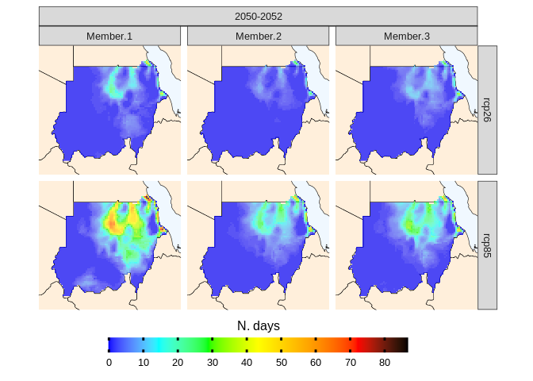
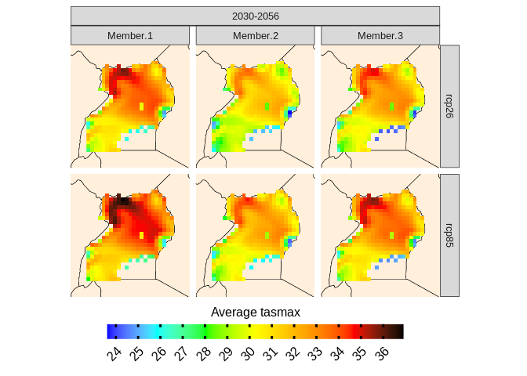
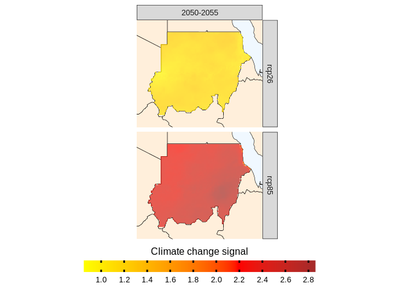
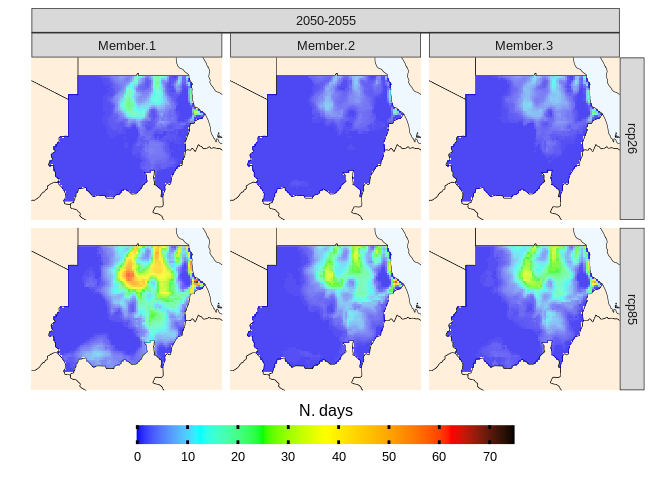

cavaR
================
2023-04-01

## Introduction

**cavaR** is a package that offers a consistent framework to load,
analyse and visualize multi-model ensembles. Particularly, cavaR is
being developed with climate models in mind, but it can be used for any
model, like impact models. Additionally, **cavaR** provides an access
point for CORDEX-CORE simulations at 25 Km resolution already
interpolated plus the W5E5 dataset. cavaR can be seen as a wrapper of
several packages, but the main engine for loading and processing climate
models is the [climate4R
framework](https://github.com/SantanderMetGroup/climate4R), applied with
a tidyverse approach.

## Installation

If you have already installed most of the climaterR packages, you can
simply install cavaR from GitHub:

    library(devtools)
    install_github("Risk-Team/cavaR")

**If you are also new to climate4R**, install its main packages first.
You can do so by

    library(devtools)
    install_github(c("SantanderMetGroup/loadeR.java",
                     "SantanderMetGroup/climate4R.UDG",
                     "SantanderMetGroup/loadeR",
                     "SantanderMetGroup/transformeR",
                     "SantanderMetGroup/climate4R.indices",
                     "SantanderMetGroup/downscaleR"))

it is possible that the installation of loadR.java fails. If so, have a
look at the [loadR main
page](https://github.com/SantanderMetGroup/loadeR) and the [wiki
page](https://github.com/SantanderMetGroup/loadeR/wiki/Installation) to
solve the issue. loadR.java depends on rJava and this installation can
be troublesome.

It is also possible to install all climate4R libraries through
conda/mamba. If you want to know more about why you should use conda and
environments with R, have a look at [this quick
tutorial](https://github.com/RSO9192/conda_R).

    conda create --name climate4R
    conda activate climate4R

then

    mamba install -y -c conda-forge -c r -c defaults -c santandermetgroup r-climate4r
    mamba install rhumba

While in your environment, open R in the terminal and type

    rhumba::install("r-devtools")

At this point you can install cavaR as described above, through
devtools.

    install.packages("usethis")
    library(devtools)
    install_github("Risk-Team/cavaR")

A docker container will follow

## A framework to work with climate data and other netCDF files

cavaR makes it easier to work with a large number of climate or impact
model simulations (netCDF files) and perform meaningful analysis. The
idea behind cavaR is to first load the data (multiple models) and then
work with the output of the load_data with other **cavaR** functions.

|  |
|:-------------------------------------------------------------------------------------------------------------------:|
|                                                  *cavaR framework*                                                  |

### First step: load the data (**locally or from remote repository**)

#### Loading data: load_data function

**cavaR** simplifies and standardize how to load multiple climate
models/simulations or other netcdf files (e.g impact models from
ISIMIP). To **load local data**, specify the path to your directories,
containing, for example, several RCPs and a folder with historical runs.

``` r
library(cavaR)

local.data <- load_data(country = "Sudan", variable="tasmax", years.hist=1980:2000, years.proj=2050:2080,
              path.to.data = "~/Databases/CORDEX-CORE/AFR-22", path.to.obs="~/Databases/W5E5")
```

``` r
head(local.data[[1]])
```

    ## # A tibble: 3 x 3
    ##   forcing    models_mbrs      obs             
    ##   <chr>      <list>           <list>          
    ## 1 historical <named list [6]> <named list [4]>
    ## 2 rcp26      <named list [6]> <named list [4]>
    ## 3 rcp85      <named list [6]> <named list [4]>

load_data will now create a multi-model ensemble (temporally consistent)
which is stored in a data frame with list columns. At this point, all
dplyr, purrr and furrr functions will work, so you can use map with
mutate, etc. You simply need to get familiar with the output of
load_data.

**To load CORDEX-CORE data stored remotely**, set path.to.data to
“CORDEX-CORE” and specify the domain. This will load CORDEX-CORE
simulations. For example:

``` r
remote.data <- load_data(country = "Sudan", variable="tasmax", years.hist=1995:2000, years.proj=2050:2055,
              path.to.data = "CORDEX-CORE", path.to.obs="W5E5", domain="AFR-22")
```

### Second step: perform analysis

The second step is the most dynamic step of the cavaR framework.

After loading the data, regardless of whether the files are climate
models or impact models, you now have a tidy tibble with list column and
you can apply all of the tidyverse functions.

#### Projections

One of the **cavaR** functions is called **projections**. As the name
gives away, this function is used to calculate indexes and other
statistics on future data. It is also possible to perform
bias-correction if observed data has been loaded (e.g W5E5). In this
example we will use one of the several functions available in cavaR (at
the moment, only projections an dclimate_change_signal).

type ?projections to better understand what analysis can be performed
with this function. It returns a RasterStack

``` r
library(magrittr)
# operations are performed for each model separately and then an ensemble mean is made. It is possible to specify thresholds with the uppert and lowert arguments
rsts <- remote.data %>%  
  projections(bias.correction = F, season = 1:12)
```

    ## 2023-04-12 17:01:00 projections, season 1-2-3-4-5-6-7-8-9-10-11-12. Calculation of mean  tasmax

``` r
# calculating number of days above 45 C
rsts_thrs <- remote.data %>% 
  projections(bias.correction = F, season = 1:12, uppert = 45, consecutive = F)
```

    ## 2023-04-12 17:01:09 projections, season 1-2-3-4-5-6-7-8-9-10-11-12. Calculation of number of days with tasmax above threshold of 45

#### Climate_change_signal

It is also possible to look at the climate change signal (delta from
historical period). Similarly to the projections function, threshold can
be specified with the uppert and lowert arguments.

``` r
library(magrittr)

rsts_ccs <- remote.data %>%  
  climate_change_signal(., season = 1:12)
```

    ## 2023-04-12 17:01:18 climate change signal, season 1-2-3-4-5-6-7-8-9-10-11-12. Climate change signal for mean tasmax

### Third step: visualize results

After performing the required analysis, it is sufficient to call the
plotting function to visualize the results. The results can be
visualized for each simulation or as an ensemble. It is also possible to
decide whether to visualize the ensemble means or standard deviation.

``` r
rsts %>%
plotting(plot_titles = "Average tasmax", ensemble=T, stat="mean") # default is mean but it can also take SD
```

    ## 2023-04-12 17:01:28
    ## Visualizing ensemble mean

    ## 2023-04-12 17:01:28
    ## Prepare for plotting

    ## 2023-04-12 17:01:28 Done

<!-- -->

``` r
rsts %>%
plotting(plot_titles = "Average tasmax", ensemble=F)
```

    ## 2023-04-12 17:01:28
    ## Visualizing individual members, argument stat is ignored

    ## 2023-04-12 17:01:28
    ## Prepare for plotting

    ## 2023-04-12 17:01:28 Done

<!-- -->

``` r
rsts_ccs %>%
plotting(plot_titles = "Climate change signal", ensemble=T, stat="mean", palette = rev(heat.colors(4))) # default is mean but it can also take SD
```

    ## 2023-04-12 17:01:29
    ## Visualizing ensemble mean

    ## 2023-04-12 17:01:29
    ## Prepare for plotting

    ## 2023-04-12 17:01:29 Done

<!-- -->

``` r
rsts_thrs %>%
plotting(plot_titles = "N. days", ensemble=F)
```

    ## 2023-04-12 17:01:30
    ## Visualizing individual members, argument stat is ignored

    ## 2023-04-12 17:01:30
    ## Prepare for plotting

    ## 2023-04-12 17:01:30 Done

<!-- -->
