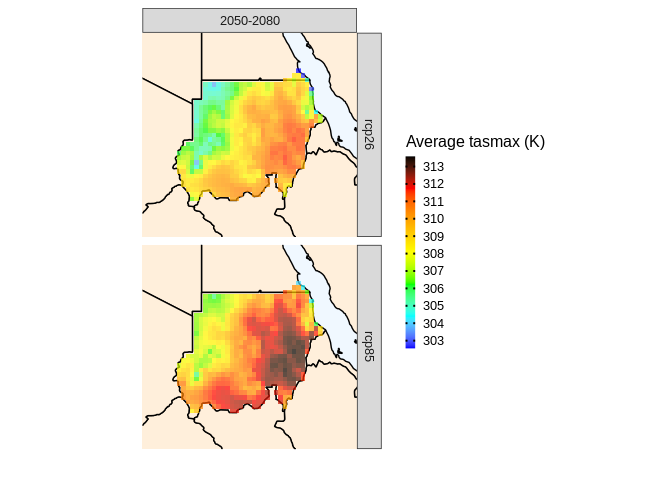

cavaR
================
2022-11-01

## Introduction

If you had hard times working with several netCDF files and perform
meaningful analysis, especially related to climate change, then this
package might be what you are looking for.

cavaR is the package version of
[CAVA-Analytics](https://github.com/Risk-Team/CAVA-Analytics). It allows
easy loading of multiple climate models, both from local data or
remotely, through
[climate4RUDG](https://github.com/SantanderMetGroup/climate4R.UDG).
cavaR can be seen as a wrapper of several packages, but the main engine
for loading and processing climate models is the [climate4R
framework](https://github.com/SantanderMetGroup/climate4R), applied with
a tidyverse approach.

## Installation

The development version of cavaR can be installed directly from github
with:

    library(devtools)
    install_github("Risk-Team/cavaR")

if you encounter problems with dependencies, such as loadeR, downscaleR
and climate4R.indices, follow the following instructions:
[loadeR](https://github.com/SantanderMetGroup/loadeR),
[downscaleR](https://github.com/SantanderMetGroup/downscaleR),
[climate4R.indices](https://github.com/SantanderMetGroup/climate4R.indices)

A conda environment will follow

## A framework to work with climate data and other netCDF files

cavaR makes it easier to work with a large number of climate or impact
model simulations (netCDF files) and perform meaningful analysis. The
idea behind cavaR is to first load the data (multiple models) and then
work with the output of the load_data with other **cavaR** functions.

|  |
|:-------------------------------------------------------------------------------------------------------------------:|
|                                                  *cavaR framework*                                                  |

### First step: load the data (locally or from remote repository)

#### Loading data: load_data function

**cavaR** simplifies and standardize how to load multiple climate
models/simulations or other netcdf files (e.g impact models from
ISIMIP). To **load local data**, specify the path to your directories,
containing, for example, several RCPs and a folder with historical runs.

    library(cavaR)

    exmp1 <- load_data(country = "Sudan", variable="tasmax", years.hist=2000, years.proj=2010,
                  path.to.rcps = "~/Databases/CORDEX-CORE/AFR-22", path.to.obs="~/Databases/W5E5")

``` r
head(local.data[[1]])
```

    ## # A tibble: 3 x 3
    ##   RCP        models_mbrs      obs             
    ##   <chr>      <list>           <list>          
    ## 1 historical <named list [6]> <named list [4]>
    ## 2 rcp26      <named list [6]> <named list [4]>
    ## 3 rcp85      <named list [6]> <named list [4]>

In this case, the path.to.rcps contained the following list of files:

|                                                                                                                                                                                                     |
|:----------------------------------------------------------------------------------------------------------------------------------------------------------------------------------------------------------------------------------------------------------------------------------------------------------------------:|
| *When data is uploaded locally, path.to.rcps would contain at least one folder called historical, containing the historical simulation runs and one or more folders per RCP, SSP or other. Within these folders, there can be multiple models or simulations that will be loaded and checked for temporal consistency* |

with a small subset of the CAS-22 domain, available with the package


    fpath <- system.file("extdata/", package="cavaR")
    exmp1 <- load_data(country = "Moldova", variable="hurs", years.hist=2000, years.proj=2010
                  path.to.rcps = fpath)

**To load CORDEX-CORE data stored remotely**, set path.to.rcps to
“CORDEX-CORE” and specify the domain. For example:


    remote.data <- load_data(country = "Sudan", variable="tasmax", years.hist=1995:2000, years.proj=2050:2060,
                  path.to.rcps = "CORDEX-CORE", path.to.obs="W5E5", domain="AFR-22")

### Second step: perform analysis

The second step is the most dynamic step of the cavaR framework.

After loading the data, regardless of whether the files are climate
models or impact models, you now have a tidy tibble with list column and
you can apply all of the tidyverse functions. One of the **cavaR**
functions is called **projections**. As the name gives away, this
function is used to calculate indexes and other statistics on future
data. It is also possible to perform bias-correction if observed data
has been loaded (e.g W5E5). In this example we will use one of the
several functions available in cavaR (at the moment, only projections).

type ?projections to better understand what analysis can be performed
with this function. It returns a RasterStack

``` r
library(magrittr)
# operations are performed for each model separately and then an ensemble mean is made
rsts <- local.data %>%  
  projections(bias.correction = F, season = 1:12, uppert=NULL, lowert = NULL, consecutive = F)
```

    ## 2022-11-18 16:04:30 projections, season 1-2-3-4-5-6-7-8-9-10-11-12. Calculation of mean  tasmax

``` r
# calculating number of days above 42 C, which is equal to 315 Kelvin
rsts_thrs <- local.data %>% 
  projections(bias.correction = F, season = 1:12, uppert = 315.15, lowert = NULL, consecutive = F)
```

    ## 2022-11-18 16:04:45 projections, season 1-2-3-4-5-6-7-8-9-10-11-12. Calculation of number of days with tasmax above threshold of 315.15

### Third step: visualize results

After performing the required analysis, it is sufficient to call the
plotting function to visualize the results

``` r
rsts %>%
plotting(plot_titles = "Average tasmax (K)")
```

    ## 2022-11-18 16:05:00 Done

<!-- -->

``` r
rsts_thrs %>%
plotting(plot_titles = "N. days")
```

    ## 2022-11-18 16:05:01 Done

<!-- -->
