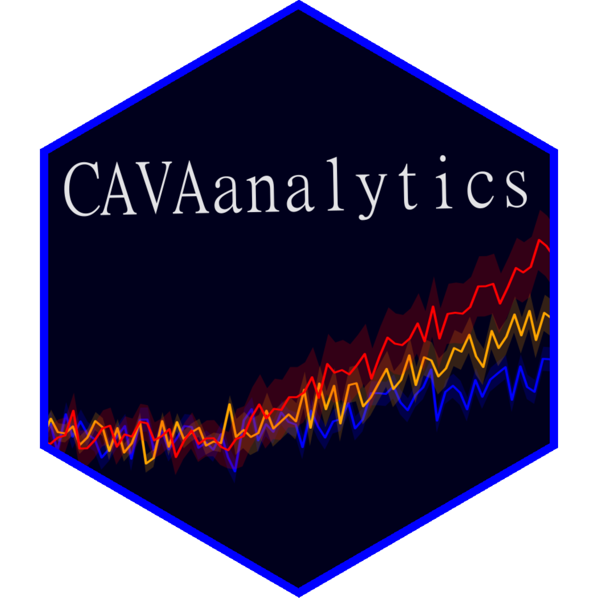

<h1 align="center">

  <br>
  <h4 align="center">CAVAanalytics: Operational R package for climate services</h4>
  <br>
<div align="center">
   
  
   
<a href="http://hits.dwyl.com/Risk-team/CAVAanalytics"></a>
</div>
</h1>


#### **Updates

**The EAS-22 domain will be release shortly**.

**In the latest CAVAanalytics release (v2) the load_data function can use xarray to download data, considerably improving speed in certain cases. Additionally, it is now possible to select multiple seasons at the same time.**

## Overview
CAVA (Climate and Agriculture Risk Visualization and Assessment) is a
framework and approach to climate services developed jointly by **The Food and Agriculture Organization of the United Nations (FAO), the University of Cantabria, Predictia and the University of Cape Town**. CAVA makes use of climate and impact model outputs to inform users about future climate and impacts on agriculture. 
Conceptually, CAVA is organised into **two modules**. 

**Climate module**: Provision of climate information from regional climate model outputs (CORDEX-CORE and reanalyses datasets)

**Agriculture module**: Provision of impact information from the Inter-Sectoral Impact Model Intercomparison Project (ISIMIP3) 

Climate modeling is a complex subject but a very good and gentle introduction to this topic is given by Andy Pitman and colleagues and can be downloaded [here](https://climateextremes.org.au/wp-content/uploads/Climate-modelling-an-overview-The-ARC-Centre-of-Excellence-for-Climate-Extremes.pdf). You are strongly encouraged to read it if you are new to this topic.  

### Climate module
CAVA makes use of outputs from Regional Climate Models. These models are used to downscale Global Climate Models at higher spatial resolution. The project in charge of providing Regional Climate Models is called CORDEX (Coordinated Regional Climate Downscaling Experiment). The outputs of these models are available for specific geographical areas around the world, called domains. More information about the data behind CAVA can be found [here](https://risk-team.github.io/CAVAanalytics/articles/Introduction.html).

|  |
|:-------------------------------------------------------------------------------------------------------------------:|
|    *Boundaries of the fourteen official CORDEX domains. [Source](https://cordex.org/data-access/regional-climate-change-simulations-for-cordex-domains/)*  |

### Agriculture module
CAVA is plannng to provide visualziation and streamline access to the impact model outputs of [ISIMIP](https://www.isimip.org/about/). This module is currently under development

## More about CAVA

Traditionally, the approach to climate science consisted of providing means for visualizing climate model outputs and information (e.g IPCC Interactive Atlas) or access points to the raw data (ESGF, Copernicus). These two approaches mainly serve basic users (the former) or advanced users (the latter). 

CAVA (Climate and Agriculture Risk Visualization and Assessment) is a
framework and approach to climate services developed jointly by **The Food and Agriculture Organization of the United Nations (FAO), the University of Cantabria, Predictia and the University of Cape Town** that aim at serving both standard users (users who need a GUI) and intermediate users (users with some programming skills who needs easy access to climate data and downstream analyses).

Therefore, [CAVA is made of a Platform
(GUI)](https://fao-cava.predictia.es/), which is freely accessible
and satisfy the needs of most standard users interested in climate (and climate change impacts in agriculture) and an R package
([**CAVAanalytics**](https://risk-team.github.io/CAVAanalytics/)), which empowers users with direct access to high-resolution climate model outputs and means for easily working and calculating climatic indicators on multi-model ensembles. 

CAVAanalytics can be used locally (installation through GitHub),
remotely (registered users can access the University of Cantabria
JupyterHub) and through a Docker image.

|  |
|:--------------------------------------------------------------------------------------------------------------------------------------------------------------------------------------------------------------------------------------------------------------------------------------------------:|
| *CAVA framework. CAVA can be used through a graphic user interface (CAVA Platform) or through the CAVAanalytics R package. The package can be used locally (GitHub installation), remotely (University of Cantabria JupyterHub), or locally but through a Docker image to solve dependencies issues. CAVA Platform offers three types of automatic reports, namely climate, custom climate indexes, and agriculture. The climate and agroclimatic reports are produced with CAVAanalytics.* |


## CAVAanalytics

[**CAVAanalytics**](https://risk-team.github.io/CAVAanalytics/) is an operational package for climate services. It offers a consistent framework to
load, analyze, calculate indicators, and visualize results for multi-model ensembles (this usually happens when working with climate models, but impact model results can also be analysed with CAVAanalytics). [**CAVAanalytics**](https://risk-team.github.io/CAVAanalytics/)
provides an access point for CORDEX-CORE simulations at 25 Km resolution
already interpolated (EPSG:4326) plus the W5E5 and ERA5 datasets. CAVAanalytics can
be seen as a wrapper of several packages, but the main engine for
loading and processing climate model outputs is the [climate4R
framework](https://github.com/SantanderMetGroup/climate4R), applied with
a tidyverse approach.

**CAVAanalytics logic will also be applied to ISIMIP impact models**

## Installation

Based on how you want to use CAVAanalytics, there are three options.

### 1) Locally

**If you are new to climate4R**, install its main packages first.
You can do so by
```
install.packages(c("rJava", "devtools"))

remotes::install_github(c("SantanderMetGroup/loadeR.java",
                 "SantanderMetGroup/climate4R.UDG",
                 "SantanderMetGroup/loadeR",
                 "SantanderMetGroup/transformeR",
                 "SantanderMetGroup/downscaleR"))
```
**Then**
```
install_github("Risk-Team/CAVAanalytics")
```
It is possible that the installation of loadR.java fails. The problem is probably related to the installation of rJava. Have a look at the [wiki
page](https://github.com/SantanderMetGroup/loadeR/wiki/Installation) to
solve the issue. If you are on Windows, [follow these instructions](https://cimentadaj.github.io/blog/2018-05-25-installing-rjava-on-windows-10/installing-rjava-on-windows-10/).

### 2) JupyterHub

You can request access to the University of Cantabria JupyterHub, where
CAVAanalytics is already installed. This will give you access to
computational resources and you would be able to perform your climate
analysis using a Jupyter Notebook environment. When using JupyterHub you will be using data physically stored at the Cantabria server. If you would like to
access these resources, you are welcome to contact
<riccardo.soldan@fao.org> or <Hideki.Kanamaru@fao.org> stating your intended usage type.

### 3) Docker

The Docker image is available at Docker.io, rso9192/cava. This docker image is built on top of [rocker/rstudio](https://davetang.org/muse/2021/04/24/running-rstudio-server-with-docker/)

#### Linux

```
sudo docker pull docker.io/rso9192/cava:version2.0.0

sudo docker run --rm \
           -p 8888:8787 \
           -e PASSWORD=password \
           -v /path/to/local/directory:/home \
           rso9192/cava:version2.0.0


```
Replace **/path/to/local/directory** with the local directory on your host machine where you want to save your plots or data. For example, you can create a folder on your Desktop called CAVA_results. Then, you would run the above command as:

```
sudo docker run --rm \
           -p 8888:8787 \
           -e PASSWORD=password \
           -v /home/Desktop/CAVA_results:/home \
           rso9192/cava:version2.0.0
```


Now open your favorite browser and type **http://localhost:8888/**. You should see a login page: enter the **username "rstudio"** and **password "password"** to login and that's it! You can now use CAVAanalytics through Rstudio server. 

#### Windows
If you are using Windows, you can install [Docker Desktop](https://docs.docker.com/desktop/install/windows-install/) first. Note that Docker Desktop would require the installation of WSL (Windows Subsystem for Linux). 

## Quick example

The idea behind CAVAanalytics is to divide the process of working with multiple models into 3 steps. **Firstly**  download or upload data (multiple
models), **secondly** perform the intended analysis, **thirdly** visualize the results.
One nice thing about step 1, is that CAVAanalytics will automatically bind multiple members to create the multimodel ensemble and check temporal consistency. It will also automatically convert units (e.g. Kelvin into Celsius). 


|  |
|:-------------------------------------------------------------------------------------------------------------------:|
|                                                *CAVAanalytics steps*                                                |

Below we give an example of how you can use CAVAanalytics to easily retrieve climate information (both past and future). More examples are available from the [CAVAanalytics website](https://risk-team.github.io/CAVAanalytics/articles/Introduction.html).

**To load CORDEX-CORE data stored remotely**, set path.to.data to
“CORDEX-CORE” and specify the domain. This will load CORDEX-CORE
simulations. Similarly, when path.to.obs is set to W5E5, you are
accessing the dataset stored remotely.


``` r
library(CAVAanalytics)
# 1st step
 remote.data <- load_data(country = "Sudan", variable="tasmax",
 years.hist=1990:2000, years.proj=2050:2060,
 path.to.data = "CORDEX-CORE", aggr.m="mean", domain="AFR-22")
# 2nd step
 climate_change_signal(remote.data, season=list(1:12), bias.correction = F) %>% 
# 3rd step
 plotting(., ensemble=TRUE, plot_titles = "Temperature change (°C)",
 palette=IPCC_palette(type = "tmp", divergent = F), bins=T)
```

|  |
|:-------------------------------------------------------------------------------------------------------------------:|
| *Average annual projected change in maximum temperature compared to the 1990-2000 baseline period in Sudan* |

## Python
**Firstly, why Python?** 

While CAVAanalytics was built on top of R packages, such as `climate4R` and `tidyverse` to allow users to focus on results rather than the code, R does not leverage the same level of "computational efficiency" as Python. This is mainly because Python offers out-of-memory computation for arrays thanks to the integration between `xarray` and `dask`. R does not have this feature for arrays, which is typically the way in which climate data is used. This means that CAVAanalytics largely works on memory (RAM), effectively limiting the geographical area in which analyses can be performed ([check out the memory-efficient functions available from CAVAanalytics though](https://risk-team.github.io/CAVAanalytics/reference/index.html)). CAVAanalytics would not allow users to perform analyses for entire CORDEX domains very efficiently because it would need a lot of RAM. However, CAVAanalytics was mainly developed for country-level assessment and never conceived to be used for large-scale climate data analyses. This is where Python comes in. The regridded CORDEX-CORE models and all observational datasets used by CAVAanalytics can also be accessed using Python. **The benefit of using our data is that we provide one URL per model for all supported variables and that we have already regridded CORDEX-CORE models, making retrieving the data extremely easy**. See below an example:

```
import xarray as xr

# URL to ERA5 data
obs_url =  "https://data.meteo.unican.es/thredds/dodsC/copernicus/cds/ERA5_0.25"
# URL to W5E5 V2 data
obs_url =    "https://data.meteo.unican.es/thredds/dodsC/mirrors/W5E5/W5E5_v2"
# Open dataset
ds = xr.open_dataset(obs_url)
```

The list of available CORDEX-CORE models can be accessed with:

```
import pandas as pd

csv_url = "https://data.meteo.unican.es/inventory.csv"
data = pd.read_csv(csv_url)

# Drop rows with missing values in the 'activity' column
data = data.dropna(subset=['activity'])

filtered_data = data[data['activity'].str.contains("FAO")]

```
A dedicated function to automatically perform these steps will be made available soon. 

## Applications

CAVAanalytics can be used by anyone interested in simple and more advanced climate change analyses. You are also free to make use of the data as input for impact models. 

## Contributing

You are welcome to fork this repository and suggest new features. For any problem, you can open [issues](https://github.com/Risk-Team/CAVAanalytics/issues) by click on **New issue** 
