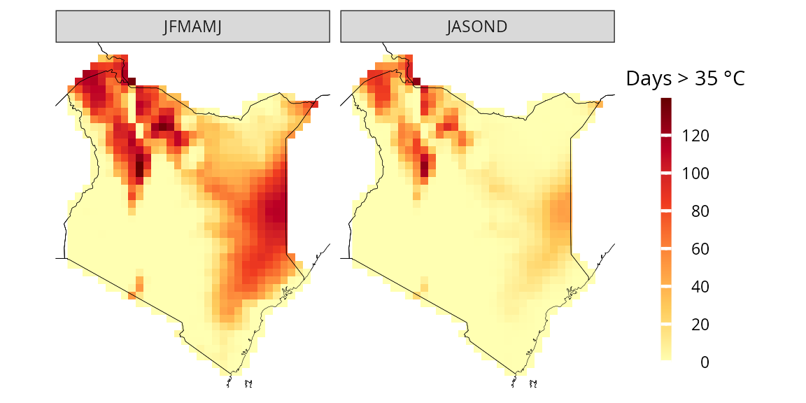
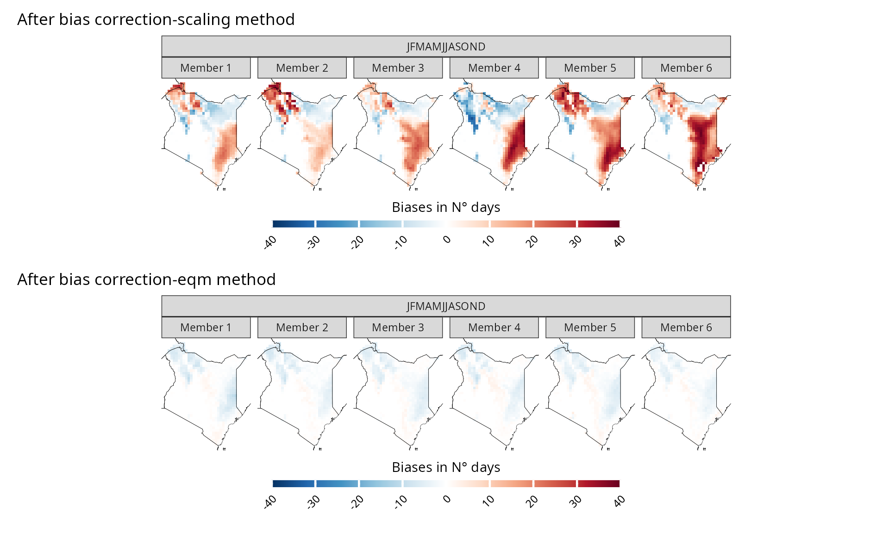
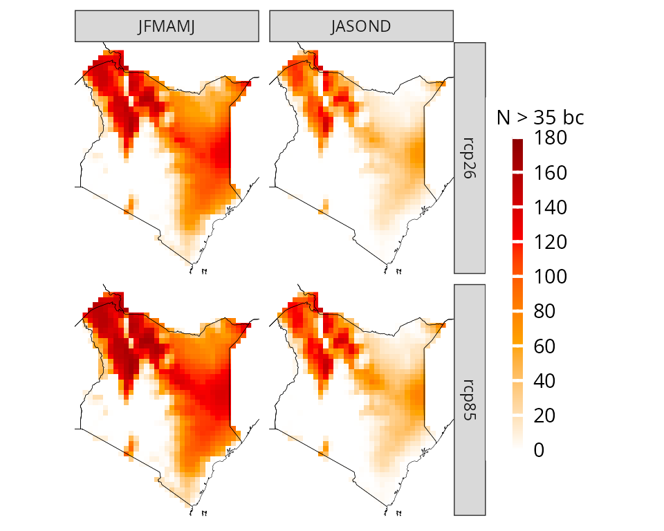
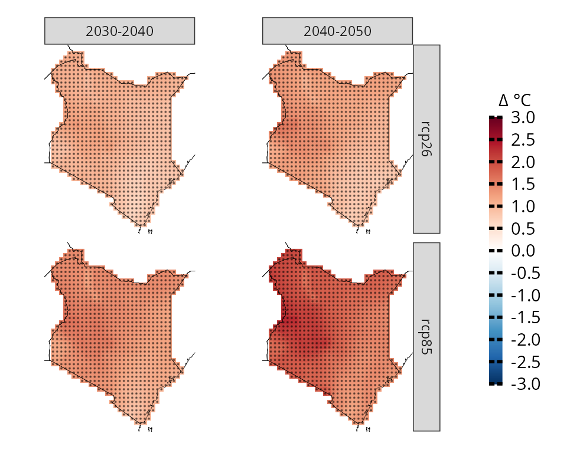

# More about CAVAanalytics

``` r

library(CAVAanalytics)
library(magrittr)
library(patchwork)
```

The main purpose of CAVAanalytics is making the processing and
visualization of multiple climate and impact models simple.
CAVAanalytics offers an access point to download CORDEX-CORE climate
models, the high resolution (25 Km) dinamically-downscaled climate
models used in the IPCC report AR5. CAVAanalytics also offers access to
state-of-the-art reanalyses datasets, such as W5E5 and ERA5.

CAVAanalytics is built on top of climate4R and several tidyverse
packages. The current available data that can be downloaded using the
package are:

### Climate module

- CORDEX-CORE simulations (3 GCMs donwscaled with 2 RCMs for two RCPs)
- W5E5 and ERA5 reanalyses datasets

Available variables are:

- Daily maximum temperature (tasmax)
- Daily minimum temperature (tasmin)
- Daily mean temperature (tas)
- Daily precipitation (pr)
- Daily relative humidity (hurs)
- Daily wind speed (sfcWind)
- Daily solar radiation (rsds)

### Agriculture module

ISIMIP3 impact models will become available in the close future

## Loading CORDEX-CORE data

Below we are automatically downloading all CORDEX-CORE simulations
alongside the observational dataset ERA5 for Kenya. As you can see, it
is very simple. We will see how to work with locally available models in
another vignette.  
**Note that this process can take a while, depending on the size of the
country and the number of years specified**

``` r

# to download a specific area, set country=NULL and specify xlim and ylim arguments. 
kenya_exmp <- load_data(path.to.data = "CORDEX-CORE", country = "Kenya", variable = "tasmax", 
years.proj = 2030:2055, years.hist = 1980:2005, domain = "AFR-22", path.to.obs = "ERA5")
```

You can explore the output using attributes(kenya_exmp).

``` r

# the main output of the loading function is a tibble with list column containing all the downloaded data
class(kenya_exmp[[1]])
#> [1] "tbl_df"     "tbl"        "data.frame"
colnames(kenya_exmp[[1]])
#> [1] "experiment"  "models_mbrs" "obs"
kenya_exmp[[1]]$experiment
#> [1] "historical" "rcp26"      "rcp85"
# the column models_mbrs stands for model members. 
#The structure of this element comes from the loadeR package. 
#The data is contained in the data element, and as you can see, it has 6 members. 
#CAVAanalytics automatically binds together multiple models and checks for temporal consistency.
dim(kenya_exmp[[1]]$models_mbrs[[1]]$Data)
#> [1]    6 9278   42   33
```

When uploading CORDEX-CORE data it is important to understand the
concept of CORDEX domains. The domain argument in load_data needs to be
correctly specified.

## Observations

We can examine historical data using the loaded observational dataset,
which, in this case, is ERA5. In this case, we are looking at the mean
historical maximum temperature for the whole year.

``` r

kenya_obs <- observations(kenya_exmp, season=list(1:12))
plotting(kenya_obs, plot_titles = "°C")
```

 If you want,
you can also use pre-defined IPCC color palettes. You can type
?IPCC_palette for more info

``` r

plotting(kenya_obs, plot_titles = "°C", 
palette = IPCC_palette(type = "tmp", divergent = F))
```


How many days above 35 °C occurred on average?

``` r

kenya_obs.35 <- observations(kenya_exmp, season=list(1:12), uppert=35)
plotting(kenya_obs.35, plot_titles = "Days > 35 °C",  palette = IPCC_palette(type = "tmp", divergent = F))
```


You can also specify more than one season at a time

``` r

observations(kenya_exmp, season=list(1:6, 7:12), uppert=35) %>% 
plotting(., plot_titles = "Days > 35 °C", palette = IPCC_palette(type = "tmp", divergent = F))
```



You can also visualize the results as a temporal trend

``` r

observations(kenya_exmp, season=list(1:6, 7:12), uppert=35) %>% 
plotting(., plot_titles = "N.days > 35 °C", temporal=T, palette="black")
```


And we can apply linear regression to each pixel to assess the
statistical significance of the yearly increase in the number of days
with Tmax higher than 35 degrees Celsius.

``` r

observations(kenya_exmp, season=list(1:12), uppert=35,trends=T) %>% 
plotting(., plot_titles = "Days/year", palette=IPCC_palette(type="tmp", divergent = T), legend_range = c(-3,3))
```


## Model biases

Before diving into the analyses of climate model projections, it is
essential to examine model biases. CAVAanalytics offers a flexible and
straightforward approach to conducting this analysis. Let’s begin by
exploring the differences in mean climatology between the CORDEX-CORE
historical experiments and ERA5.

``` r

# you can specify the season. In this case we are looking at the whole year
biases_kenya <- model_biases(kenya_exmp, season=list(1:12))

a=plotting(biases_kenya, ensemble=F, temporal=T, 
plot_titles = "Biases in °C")+ggplot2::ggtitle("Before bias correction")

b=plotting(biases_kenya, ensemble=F, 
temporal=F, plot_titles = "Biases in °C", palette = IPCC_palette(type="tmp", divergent = T))


a/b
```


As we can see, the biases are mainly positive, hence CORDEX-CORE models
are warmer than the “observed” data. However, what happens if we bias
correct the data? The results look much better now and mean biases are
reduced thanks to bias correction. Bias correction is applied with the
[Empirical Quantile Mapping (eqm) method as default but Quantile Delta
Mapping (qdm) or
scaling](https://rdrr.io/github/SantanderMetGroup/downscaleR/man/biasCorrection.html)
can also be used. Cross-validation is used to avoid overfitting.

``` r

bs_scaling=model_biases(kenya_exmp, season=list(1:12), bias.correction = T, method="scaling", cross_validation = "3fold")

a=plotting(bs_scaling, ensemble=F, temporal=T, plot_titles = "Biases in °C", legend_range = c(-1.5,1.5))+ggplot2::ggtitle("After bias correction-scaling method")
b=plotting(bs_scaling, plot_titles =  "Biases in °C",legend_range = c(-0.09,0.09), ensemble = F ,palette=IPCC_palette(type="tmp", divergent = T))

a/b
```


If we want to explore model biases biases on, let’s say, the number of
very warm days (days with maximum temperature above 35 °C), then the
choice of the bias-correction method is very important. Empirical
quantile methods are much more suitable in this case because they
correct the data distribution.

``` r


bias.scaling=model_biases(kenya_exmp, season=list(1:12), uppert=35, bias.correction = T, method="scaling", cross_validation = "3fold")

a=plotting(bias.scaling, ensemble=F,  legend_range = c(-40,40), palette = IPCC_palette(type = "tmp", divergent = T), plot_titles = "Biases in N° days")+ggplot2::ggtitle("After bias correction-scaling method")

bias.eqm=model_biases(kenya_exmp, season=list(1:12), uppert=35, bias.correction = T, method="eqm", cross_validation = "3fold")

b=plotting(bias.eqm, ensemble=F, legend_range = c(-40,40), palette = IPCC_palette(type = "tmp", divergent = T), plot_titles = "Biases in N° days")+ggplot2::ggtitle("After bias correction-eqm method")

a/b
```



## Pre-computed bias-corrected datasets

As an alternative to performing bias correction locally, CAVAanalytics
now provides access to pre-computed bias-corrected CORDEX-CORE
simulations. These datasets have been bias-corrected using ERA5 as the
reference dataset following the ISIMIP methodology, and are currently
available for the AFR-22 and WAS-22 domains (with additional domains to
be released soon).

To load these pre-computed bias-corrected datasets, simply use
`path.to.data = "CORDEX-CORE-BC"` instead of
`path.to.data = "CORDEX-CORE"`. **We also load the ERA5 observations to
verify the bias correction.**

``` r

# Load pre-computed bias-corrected CORDEX-CORE data
kenya_bc <- load_data(path.to.data = "CORDEX-CORE-BC", country = "Kenya", variable = "tasmax", 
years.proj = 2030:2055, years.hist = 1980:2005, domain = "AFR-22", path.to.obs = "ERA5")
```

We can now verify that the data is bias-corrected by comparing it
against the observations for the number of very warm days (days with
maximum temperature above 35 °C)

``` r

# Calculate biases. We set bias.correction = FALSE to see the actual state of the data
biases_kenya_bc <- model_biases(kenya_bc, season=list(1:12), uppert=35, bias.correction = F)

plotting(biases_kenya_bc, ensemble=F, legend_range = c(-40,40), palette = IPCC_palette(type = "tmp", divergent = T), plot_titles = "Biases in N° days")+ ggplot2::ggtitle("Pre-bias correcetd data with ISIMIP methodology")
```


As shown above, the biases are negligible. This means you can directly
use the data for projections and climate change signal analysis without
needing to apply bias correction:

Since the data is already bias-corrected, you should **not** set
`bias.correction = TRUE` when using functions like
[`projections()`](https://risk-team.github.io/CAVAanalytics/reference/projections.md)
or
[`climate_change_signal()`](https://risk-team.github.io/CAVAanalytics/reference/climate_change_signal.md)
with these datasets.

## Projections

Now that we looked at model biases, we can start exploring future
projections. For example, what if you want to have a look at what will
be the projected maximum temperature in Kenya for the 2030-2055 time
period? **Let’s remember that these models have positive biases
though.**

``` r

# you can specify the season. In this case we are looking at the whole year
proj_kenya <- projections(kenya_exmp, season=list(1:12))
# stat can take either mean or sd. It is used in combination with ensemble=T. Default is always mean
plotting(proj_kenya, ensemble=T, stat="mean", plot_titles = "mean tasmax")
```


``` r

plotting(proj_kenya, ensemble=F, stat="mean", plot_titles = "mean tasmax")
```



In certain cases, focusing solely on mean temperatures might not provide
the insights we need. Instead, we might be interested in understanding
the frequency of specific conditions projected to occur. For instance,
we may want to determine the number of days with maximum temperatures
above 35 °C.

``` r

proj_kenya_35 <- projections(kenya_exmp, season=list(1:6, 7:12), uppert=35)
plotting(proj_kenya_35, ensemble=T,  legend_range = c(0, 180),
plot_titles = "N > 35", palette=c("white", "orange", "red", "darkred"))
```


If we remember, we assessed that there are model biases. Therefore,
CAVAanalytics offers a straightforward solution by automatically
implementing bias correction using the empirical quantile mapping method
as default. This process allows us to correct for discrepancies between
observed data and model outputs. Note that CAVAanalytics allows the
selection of three bias-correction methods.

``` r

# bias correction is applied with the widely used empirical quantile method
proj_kenya_35bc <- projections(kenya_exmp, season=list(1:6, 7:12), bias.correction = T, uppert=35)
plotting(proj_kenya_35bc, ensemble=T,  
plot_titles = "N > 35 bc", 
palette=c("white", "orange", "red", "darkred"), legend_range = c(0, 180))
```


The results can also be visualized for the annual time series (data is
spatially aggregated).

``` r

plotting(proj_kenya_35bc, ensemble=T,  
plot_titles = "N > 35 bc", temporal=T, palette=c("blue", "red"))
```


and without spatial or temporal aggregation. In this case we are looking
at the frequency distribution of the yearly data across all pixels

``` r

plotting(proj_kenya_35bc, ensemble=T,  
plot_titles = "N > 35 bc", spatiotemporal=T, palette=c("blue", "red"))
```


## Climate change signal

While analyzing future periods can be useful, more often we prioritize
understanding delta changes, which represent the relative increase or
decrease in mean maximum temperatures compared to a baseline.
CAVAanalytics facilitates this analysis as well, which is more common
than looking at projected absolute values.

To notice that the function climate_change_signal also calculates the
agreement in the sign of the change. Basically, with a threshold of 0.8,
it means that if 80% of the models agree that the climate change signal
is positive or negative, the pixel gets a score of 1. These results are
visualized through a black dot.

When working with precipitation, it can be useful to look at the results
in percentages. This can be done easily by specifying percentage as TRUE
in climate_change_signal

``` r

ccs_kenya <- climate_change_signal(kenya_exmp, season=list(1:6,7:12), threshold = 0.8)

plotting(ccs_kenya, plot_titles = "Δ °C", 
legend_range = c(-3, 3), 
palette = IPCC_palette(type = "tmp", divergent = T))
```


Anomalies can also be visualized for the annual time series

``` r

plotting(ccs_kenya, plot_titles = "Annual Δ (°C)", temporal=T, palette=c("blue", "red"))
```


## Customise plot apperances

CAVAanalytics also offer some easy to use function to modify plot
appearances. For example, we can remove all facet text from the ggplot
object

``` r


plotting(ccs_kenya, plot_titles = "Δ °C", 
legend_range = c(-3, 3), 
palette = IPCC_palette(type = "tmp", divergent = T), point_size=0.08)+
remove_facets(position = "both") # remove facet text
```



We can also produce more complex plots, for example we can look at two
time frames

``` r


# subset model projections years
kenya_exmp_2030_2040= years_selection(kenya_exmp, years = 2030:2040, projections = T)
kenya_exmp_2040_2050= years_selection(kenya_exmp, years = 2040:2050, projections = T)

# calculate climate change signal for thw two time frames
ccs_kenya_2030_2040 <- climate_change_signal(kenya_exmp_2030_2040, season=list(1:12), threshold = 0.8)
ccs_kenya_2040_2050 <- climate_change_signal(kenya_exmp_2040_2050, season=list(1:12), threshold = 0.8)

# make first plot, rename facet label
p1= plotting(ccs_kenya_2030_2040, plot_titles = "Δ °C", 
legend_range = c(-3, 3), 
palette = IPCC_palette(type = "tmp", divergent = T), point_size=0.08)+
rename_facets(current_label = "JFMAMJJASOND", new_label = "2030-2040")+
remove_facets(position = "y")

# make second plot, rename facet label
p2= plotting(ccs_kenya_2040_2050, plot_titles = "Δ °C", 
legend_range = c(-3, 3), 
palette = IPCC_palette(type = "tmp", divergent = T), point_size=0.08)+
rename_facets(current_label = "JFMAMJJASOND", new_label = "2040-2050")

# combine the plots and collect the legend. You need to have patchwork installed first 
p1+p2+plot_layout(guides = "collect")
```


