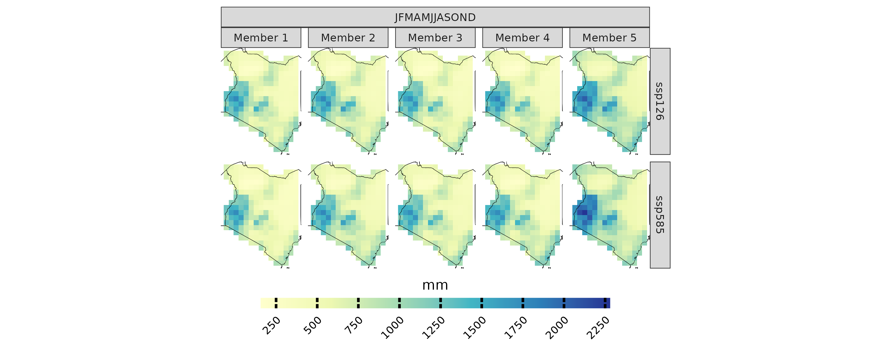
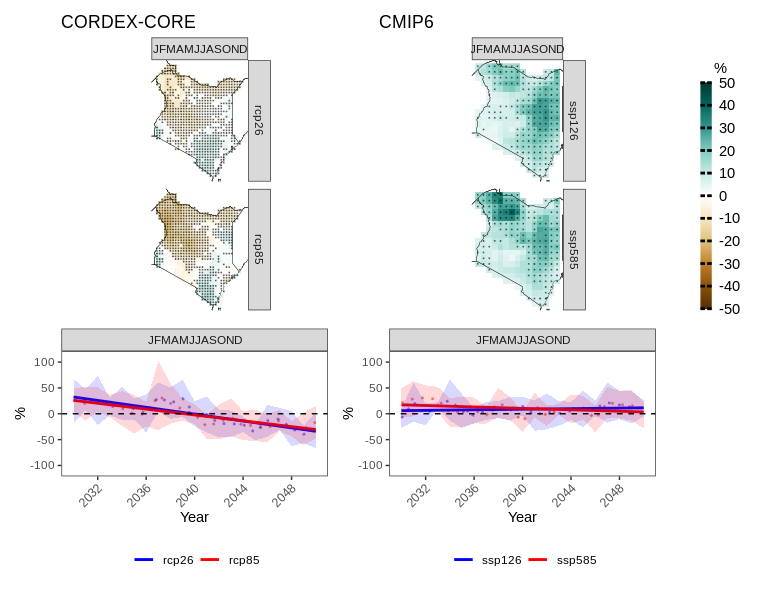

# Analysis of CMIP6 Models using CAVAanalytics

``` r

library(CAVAanalytics)
library(magrittr)
library(patchwork)
```

## Introduction

CAVAanalytics is a versatile framework designed for the analysis and
visualization of gridded climate data. This document will guide you
through the process of handling CMIP6 model outputs, which have been
downscaled and bias-corrected using the ISIMIP methodology. The models
are accessible via [ISIMIP’s official portal](https://www.isimip.org/).

### Downloading CMIP6-ISIMIP climate datasets

To facilitate the download of the necessary climate datasets, we have
prepared a convenient bash script. This script and its usage are
documented [in our GitHub
repository](https://github.com/Risk-Team/ISIMIP). Below is an example of
how to execute the script:

``` r
bash isimip.sh -m all -v pr -s all -x "32 41" -y "-5 5"
```

This script will download historical data and future scenarios (ssp126
and ssp585) for five GCMs, and it will automatically generate ncml files
to merge individual NetCDF files.

Note: Windows users can enable the Windows Subsystem for Linux (WSL) to
run bash scripts natively.

### Processing the CMIP6-ISIMIP climate datasets with CAVAanalytics

Once the data is downloaded, it can be loaded into CAVAanalytics as
shown below:

``` r


isimip_data= load_data(path.to.data = "/home/riccardo/Downloads/isimip_kenya/ncml/", country = "Kenya", variable = "pr",
                       years.hist = 1980:2000, years.proj =2030:2050, path.to.obs = "W5E5")
```

Note: Precipitation data should be converted from kg/m²/s to mm/day by
multiplying by 86400.

``` r


isimip_data[[1]]= isimip_data[[1]] %>% 
  dplyr::mutate(models_mbrs=purrr::map(models_mbrs, ~ transformeR::gridArithmetics(.x, 86400, operator = "*")))
```

The following code snippet visualizes the mean cumulative precipitation
for the CMIP6 models

``` r


projections(isimip_data, season = list(1:12)) %>% 
plotting(try, plot_titles = "mm", ensemble = F, palette = IPCC_palette(type = "pr", divergent = F))
```



### CORDEX-CORE vs. CMIP6 Model Outputs

This section presents a quick comparison between the climate change
signals in mean total annual precipitation projected by the CMIP6 and
CORDEX-CORE ensembles for Kenya (**for demonstration purposes only**).

``` r


cordex_data <- load_data(path.to.data = "CORDEX-CORE", country = "Kenya", variable = "pr", 
                        years.proj = 2030:2050, years.hist = 1980:2000, domain = "AFR-22", path.to.obs = "W5E5")
```

The following figures provide a comparative visualization of the
projected changes

``` r


a=climate_change_signal(cordex_data , season = list(1:12), percentage = T) %>% 
plotting(., palette = IPCC_palette(type = "pr",divergent = T),  plot_titles = "%", legend_range = c(-50,50))+
  ggplot2::ggtitle("CORDEX-CORE")

a.tr=climate_change_signal(cordex_data , season = list(1:12), percentage = T) %>% 
  plotting(., plot_titles = "%", palette = c("blue", "red"),temporal = T, legend_range = c(-110,110))+
  ggplot2::geom_hline(yintercept = 0,
  linetype = "dashed",
  color = "black")

b=climate_change_signal(isimip_data, season = list(1:12), percentage = T) %>% 
plotting(., palette = IPCC_palette(type = "pr",divergent = T), plot_titles = "%", legend_range = c(-50,50))+
  ggplot2::ggtitle("CMIP6")

b.tr=climate_change_signal(isimip_data , season = list(1:12), percentage = T) %>% 
  plotting(., plot_titles = "%",palette = c("blue", "red"), temporal = T, legend_range = c(-110,110))+
  ggplot2::geom_hline(yintercept = 0,
                      linetype = "dashed",
                      color = "black")

combined=a+b+plot_layout(guides = "collect")

combined/(a.tr+b.tr)+ plot_layout(heights = c(2, 1))
```



Initial analysis indicates a significant discrepancy in the climate
change signal for precipitation between the two data sets. The
CMIP6-ISIMIP ensemble shows a positive climate change signal for
precipitation compared to the CORDEX-CORE ensemble.

**CORDEX-CORE Models**: These models potentially provide better
resolution of [large-scale phenomena
impacts](https://journals.ametsoc.org/view/journals/clim/26/21/jcli-d-12-00708.1.xml)
and spatial variability.

**ISIMIP CMIP6 Data**: This dataset is not dynamically downscaled,
possibly leading to less precise representation of local spatial
precipitation patterns compared to CORDEX-CORE under these
circumstances.
