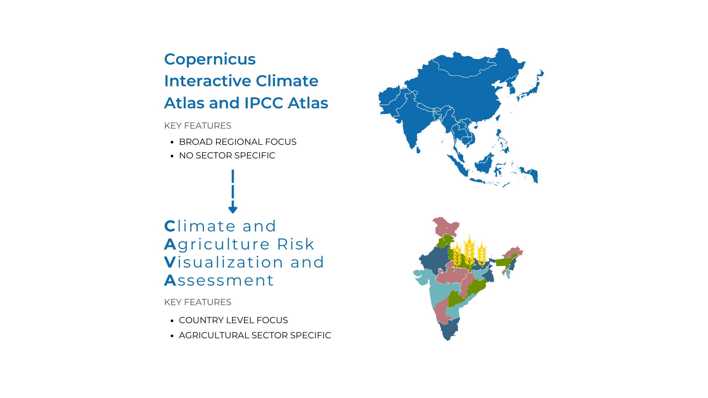
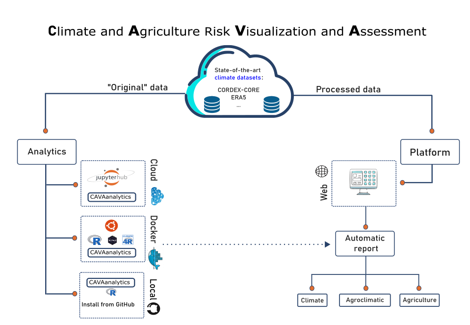
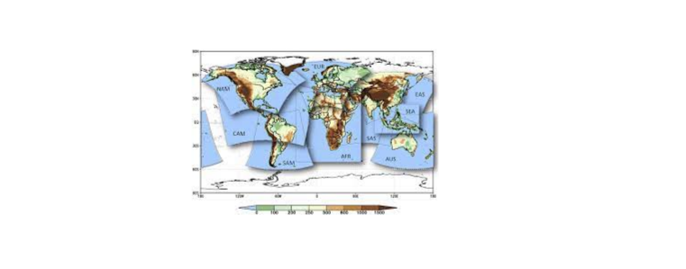

```{r, include = FALSE}
knitr::opts_chunk$set(
  collapse = TRUE,
  comment = "#>"
)
```

CAVAanalytics is part of a broader framework, called CAVA (Climate and Agriculture Risk Visualization and Assessment) designed to democratize the accessibility and visualization of climate data for agricultural climate services. CAVA is developed jointly by **The Food and Agriculture Organization of the United Nations (FAO), the University of Cantabria, Predictia and the University of Cape Town**. The university of Cantabria and Predictia are also the developers of the [Copernicus Climate Atlas](https://climate.copernicus.eu/copernicus-interactive-climate-atlas-game-changer-policymakers#:~:text=The%20new%20Copernicus%20Interactive%20Climate,future%20climate%20change%20information%20using).

## CAVA's Relationship with the COPERNICUS Climate Atlas and the IPCC Atlas

The new COPERNICUS Climate Atlas was developed by The University of Cantabria and Predictia and built from the IPCC Interactive Atlas. These two tools are excellent web applications that allow users to quickly and reliably visualize past and future climate change information for broad geographical areas.

CAVA positions itself as a specialized tool which conveys climate information at country level and also delivers climate change information for a specific sector, agriculture. For example, this is made possible through the visualization of specific agroclimatic indicators or the possibility of downloading daily data that can be used for crop model forcing. CAVA also uses some of the climate data sources also used by the COPERNICUS Climate Atlas. 


```{r fig1, echo=FALSE, message=FALSE, warning=FALSE, fig.cap="*CAVA can be conceived as a specialised tool compared to the IPCC Interactive Atlas and the COPERNICUS Climate Atlas. These tools are complementary with each other and the selection of the right application depend on the user needs.*"}



```

## The idea behind CAVA development

The democratization of climate data has historically oscillated between two primary modalities: the visualization of climate model outputs for general understanding (illustrated by tools like the IPCC Interactive Atlas) and the provision of direct access to raw climate data for in-depth analysis (exemplified by data access points like ESGF). This bifurcation has traditionally catered to either novice or expert users, leaving a gap for those in-between.

CAVA emerges as a comprehensive solution designed to bridge this divide, catering to a broader audience that includes both standard users, who prefer graphical user interfaces (GUIs) for their simplicity, and intermediate users, who possess some programming acumen and require more direct access to climate data for advanced analysis.

The CAVA ecosystem is bifurcated into two distinct components to accommodate this diverse user base. The first component is a [**Platform GUI**](https://fao-cava.predictia.es/), which is freely accessible and specifically designed to meet the needs of standard users. This platform focuses on climate and its impact on agriculture, presenting data in a user-friendly manner that does not compromise on depth or relevance.

The second component is an R package, [**CAVAanalytics**](https://risk-team.github.io/CAVAanalytics/), tailored for those who seek a more hands-on approach to climate data. This package provides direct access to climate model outputs, enabling users to easily work with and calculate climatic indicators across multi-model ensembles.

By offering these complementary tools, CAVA represents a holistic approach to engaging with climate data, ensuring that users across the spectrum, from those seeking simplicity and ease of use to those requiring depth and flexibility for complex analyses, are well-served.

```{r fig2, echo=FALSE, message=FALSE, warning=FALSE, fig.cap="*CAVA can be used through a graphic user interface (CAVA Platform) or through the CAVAanalytics R package. The package can be used locally (GitHub installation), remotely (University of Cantabria JupyterHub), or locally but through a Docker image to solve dependencies issues. CAVA Platform offers three types of automatic reports, namely climate, custom climate indexes, and agriculture. The climate and agroclimatic reports are produced with CAVAanalytics*"}



```
CAVA is strategically structured around **two primary modules** to provide users with in-depth insights into climate and agricultural impacts. This bifurcation facilitates targeted analysis and data exploration, catering to the specific needs of the user base.

**Climate module**: Provision of climate information from regional climate model outputs (CORDEX-CORE and reanalyses datasets)

**Agriculture module**: Provision of impact information from the Inter-Sectoral Impact Model Intercomparison Project (ISIMIP3) 

### Climate module
CAVA makes use of outputs from Regional Climate Models. These models are used to downscale Global Climate Models at higher spatial resolution. The project in charge of providing Regional Climate Models is called CORDEX (Coordinated Regional Climate Downscaling Experiment). The outputs of these models are available for specific geographical areas around the world, called domains. More information about the data behind CAVA can be found [here](https://risk-team.github.io/CAVAanalytics/articles/Introduction.html).

{#fig:figure-2}

### Agriculture module
The Agriculture Module is under development with the aim of providing streamlined visualization and access to agricultural impact model outputs, courtesy of the [Inter-Sectoral Impact Model Intercomparison Project (ISIMIP3)](https://www.isimip.org/about/).

Through these two meticulously designed modules, CAVA embarks on a mission to offer comprehensive and accessible climate and agricultural impact data. By segregating the platform into distinct but complementary components, CAVA ensures that users can navigate and utilize the wealth of information with ease, enabling informed decision-making and research in the realms of climate science and agricultural planning.


