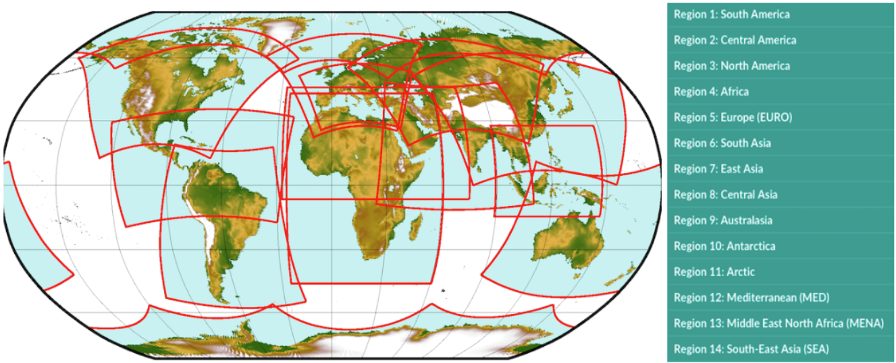

```{r, include = FALSE}
knitr::opts_chunk$set(
  collapse = TRUE,
  comment = "#>"
)
```

```{r setup, message=F, warning=FALSE}
library(CAVAanalytics)
library(magrittr)
```


The main purpose of CAVAanalytics is making the processing and visualization of multiple climate and impact models simple. CAVAanalytics offers an access point to download CORDEX-CORE climate models, the high resolution (25 Km) dinamically-downscaled climate models used in the IPCC report AR5. CAVAanalytics also offers access to state-of-the-art reanalyses datasets, such as W5E5 and ERA5. 

CAVAanalytics is built on top of climate4R and several tidyverse packages. The current available data that can be downloaded using the package are:

### Climate module
* CORDEX-CORE simulations (3 GCMs donwscaled with 2 RCMs for two RCPs)
* W5E5 and ERA5 reanalyses datasets

Available variables are:

* Daily maximum temperature (tasmax)
* Daily minimum temperature (tasmin)
* Daily mean temperature (tas)
* Daily precipitation (pr)
* Daily relative humidity (hurs)
* Daily wind speed (sfcWind)
* Daily solar radiation (rsds)

### Agriculture module
ISIMIP3 impact models will become available in the close future

## Loading CORDEX-CORE data
Below we are automatically downloading all CORDEX-CORE simulations alongside the observational dataset ERA5 for Kenya. As you can see, it is very simple. We will see how to work with locally available models in another vignette.  
**Note that this process can take a while, depending on the size of the country and the number of years specified**

```{r, message=FALSE, warning=F}
# to download a specific area, set country=NULL and specify xlim and ylim arguments. 
kenya_exmp <- load_data(path.to.data = "CORDEX-CORE", country = "Kenya", variable = "tasmax", 
years.proj = 2030:2055, years.hist = 1980:2005, domain = "AFR-22", path.to.obs = "ERA5")

```

You can explore the output using attributes(kenya_exmp).

```{r,  message=F, warning=F}
# the main output of the loading function is a tibble with list column containing all the downloaded data
class(kenya_exmp[[1]])
colnames(kenya_exmp[[1]])
kenya_exmp[[1]]$experiment
# the column models_mbrs stands for model members. The structure of this element comes from the loadeR package. The data is contained in the data element, and as you can see, it has 6 members. CAVAanalytics automatically binds together multiple models and checks for temporal consistency.
dim(kenya_exmp[[1]]$models_mbrs[[1]]$Data)
```

When uploading CORDEX-CORE data it is important to understand the concept of CORDEX domains. The domain argument in load_data needs to be correctly specified. Below is an example of the available CORDEX domains.

{#fig:figure-1}

## Observations

We can examine historical data using the loaded observational dataset, which, in this case, is ERA5. In this case, we are looking at the mean historical maximum temperature for the whole year. 

```{r, fig.height=3, fig.width=4, fig.align="center",  message=F, warning=F}
kenya_obs <- observations(kenya_exmp, season=list(1:12))
plotting(kenya_obs, plot_titles = "Mean tasmax")
```
If you want, you can also use pre-defined IPCC color palettes. You can type ?IPCC_palette for more info

```{r, fig.height=3, fig.width=4, fig.align="center",  message=F, warning=F}
plotting(kenya_obs, plot_titles = "Mean tasmax", 
palette = IPCC_palette(type = "tmp", divergent = F))
```

How many days above 35 °C occurred on average?
```{r, fig.height=3, fig.width=4, fig.align="center",  message=F, warning=F}
kenya_obs.35 <- observations(kenya_exmp, season=list(1:12), uppert=35)
plotting(kenya_obs.35, plot_titles = "N.days > 35")
```

You can also specify more than one season at a time

```{r, fig.height=4, fig.width=4, fig.align="center",  message=F, warning=F}
observations(kenya_exmp, season=list(1:6, 7:12), uppert=35) %>% 
plotting(., plot_titles = "N.days > 35")
```

You can also visualize the results as a temporal trend

```{r, fig.height=4, fig.width=4, fig.align="center",  message=F, warning=F}
observations(kenya_exmp, season=list(1:6, 7:12), uppert=35) %>% 
plotting(., plot_titles = "N.days > 35", temporal=T, palette="black")
```

And we can apply linear regression to each pixel to assess the statistical significance of the yearly increase in the number of days with Tmax higher than 35 degrees Celsius.

```{r, fig.height=4, fig.width=4, fig.align="center",  message=F, warning=F}
observations(kenya_exmp, season=list(1:12), uppert=35,trends=T) %>% 
plotting(., plot_titles = "N.days > 35/year", palette=IPCC_palette(type="tmp", divergent = T), legend_range = c(-3,3))
```


## Model biases

Before diving into the analyses of climate model projections, it is essential to examine model biases. Defining biases can be somewhat arbitrary as it depends on the specific and intended usage of climate models. However, CAVAanalytics offers a flexible and straightforward approach to conducting this analysis. Let's begin by exploring the differences in mean climatology between the CORDEX-CORE historical experiments and ERA5.

```{r, fig.height=3, fig.width=10,  message=F, warning=F}
# you can specify the season. In this case we are looking at the whole year
biases_kenya <- model_biases(kenya_exmp, season=list(1:12))
plotting(biases_kenya, ensemble=F, 
temporal=F, plot_titles = "mean tasmax biases", palette = IPCC_palette(type="tmp", divergent = T))
```

```{r, fig.height=3, fig.width=10,  message=F, warning=F}
plotting(biases_kenya, ensemble=F, temporal=T, 
plot_titles = "mean tasmax biases")+ggplot2::ggtitle("Before bias correction")
```
As we can see, the biases are mainly positive, hence CORDEX-CORE models are warmer than the "observed" data. However, what happens if we bias correct the data?
The results look much better now and mean biases are reduced thanks to bias correction. Bias correction is applied with the [Empirical Quantile Mapping (eqm) method as default but Quantile Delta Mapping (qdm)](https://rdrr.io/github/SantanderMetGroup/downscaleR/man/biasCorrection.html) can also be used.

```{r, fig.height=3, fig.width=10,  message=F, warning=F}
biases_kenya.bs <- model_biases(kenya_exmp, season=list(1:12), bias.correction = T)
plotting(biases_kenya.bs, ensemble=F, temporal=T, plot_titles = "mean tasmax biases")+ggplot2::ggtitle("After bias correction-eqm method")
```


## Projections

Now that we looked at model biases, we can start exploring future projections. For example, what if you want to have a look at what will be the projected maximum temperature in Kenya for the 2030-2055 time period? **Let's remember that these models have positive biases though.**

```{r, fig.height=4, fig.width=3, fig.align="center",  message=F, warning=F}
# you can specify the season. In this case we are looking at the whole year
proj_kenya <- projections(kenya_exmp, season=list(1:12))
# stat can take either mean or sd. It is used in combination with ensemble=T. Default is always mean
plotting(proj_kenya, ensemble=T, stat="mean", plot_titles = "mean tasmax")
```


```{r, fig.height=4, fig.width=10,  message=F, warning=F}
plotting(proj_kenya, ensemble=F, stat="mean", plot_titles = "mean tasmax")
```

In certain cases, focusing solely on mean temperatures might not provide the insights we need. Instead, we might be interested in understanding the frequency of specific conditions projected to occur. For instance, we may want to determine the number of days with maximum temperatures above 35 °C.


```{r, fig.height=4, fig.width=5, fig.align="center",  message=F, warning=F}
proj_kenya_35 <- projections(kenya_exmp, season=list(1:6, 7:12), uppert=35)
plotting(proj_kenya_35, ensemble=T,  legend_range = c(0, 180),
plot_titles = "N > 35", palette=c("white", "orange", "red", "darkred"))
```

When dealing with model biases, CAVAanalytics offers a straightforward solution by automatically implementing bias correction using the empirical quantile mapping method. This process allows us to correct for discrepancies between observed data and model outputs.

```{r, fig.height=4, fig.width=5, fig.align="center", message=F, warning=F}
# bias correction is applied with the widely used empirical quantile method
proj_kenya_35bc <- projections(kenya_exmp, season=list(1:6, 7:12), bias.correction = T, uppert=35)
plotting(proj_kenya_35bc, ensemble=T,  
plot_titles = "N > 35 bc", 
palette=c("white", "orange", "red", "darkred"), legend_range = c(0, 180))
```

The results can also be visualized for the annual time series (data is spatially aggregated).

```{r, fig.height=3, fig.width=5, fig.align="center", message=F, warning=F}
plotting(proj_kenya_35bc, ensemble=T,  
plot_titles = "N > 35 bc", temporal=T, palette=c("blue", "red"))
```

and without spatial or temporal aggregation. In this case we are looking at the frequency distribution of the yearly data across all pixels 

```{r, fig.height=3, fig.width=5, fig.align="center", message=F, warning=F}
plotting(proj_kenya_35bc, ensemble=T,  
plot_titles = "N > 35 bc", spatiotemporal=T, palette=c("blue", "red"))
```


## Climate change signal

While analyzing future periods can be useful, more often we prioritize understanding delta changes, which represent the relative increase or decrease in mean maximum temperatures compared to a baseline. CAVAanalytics facilitates this analysis as well.

```{r, fig.height=4, fig.width=10,  message=F, warning=F}
ccs_kenya <- climate_change_signal(kenya_exmp, season=list(1:12))
plotting(ccs_kenya, ensemble=F, plot_titles = "Mean tasmax change", 
legend_range = c(-3, 3), 
palette = c("blue", "cyan", "green", "white", "yellow" ,"orange", "red"))
```


## Climate change signal

While analyzing future periods can be useful, more often we prioritize understanding delta changes, which represent the relative increase or decrease in mean maximum temperatures compared to a baseline. CAVAanalytics facilitates this analysis as well.

To notice that the function climate_change_signal also calculates the agreement in the sign of the change. Basically, with a threshold of 0.8, it means that if 80% of the models agree that the climate change signal is positive or negative, the pixel gets a score of 1. These results are visualized through a black dot. 

When working with precipitation, it can be useful to look at the results in percentages. This can be done easily by specifying percentage as TRUE in climate_change_signal

```{r, fig.height=4, fig.width=10,  message=F, warning=F}
ccs_kenya <- climate_change_signal(kenya_exmp, season=list(1:6,7:12), threshold = 0.8)

plotting(ccs_kenya, plot_titles = "Mean tasmax change", 
legend_range = c(-3, 3), 
palette = IPCC_palette(type = "tmp", divergent = T))

```

Anomalies can also be visualized for the annual time series

```{r, fig.height=3, fig.width=5,  message=F, warning=F}
plotting(ccs_kenya, plot_titles = "Annual anomalies", temporal=T, palette=c("blue", "red"))

```
