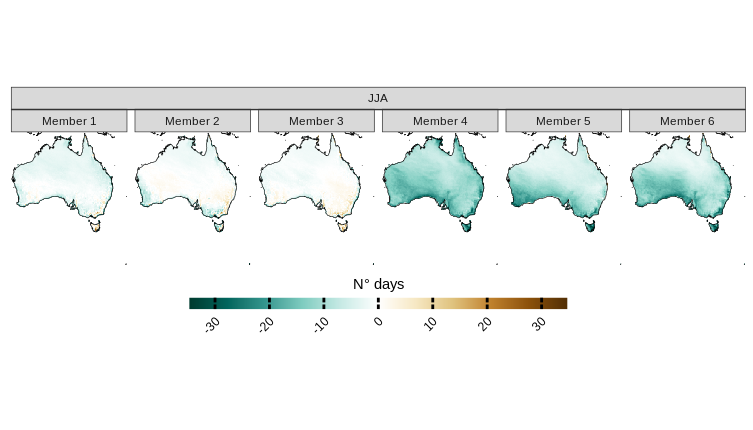

```{r, include = FALSE}
knitr::opts_chunk$set(
  collapse = TRUE,
  comment = "#>"
)
```


```{r setup, message=F, warning=FALSE}
library(CAVAanalytics)
library(patchwork)
library(ggplot2)
library(magrittr)
```

Despite the potential challenge of working with vast datasets, CAVAanalytics provides memory-efficient functions that facilitate processing in spatial chunks. Although this approach requires additional computational time, it enables the analysis of large areas within the constraints of available memory.

For instance, to calculate biases in the CORDEX-CORE model simulations for the number of dry days across Australia during winter, using ERA5 as the observational reference dataset, CAVAanalytics offers the load_data_and_model_biases function. This function allows for the analysis to be conducted in manageable spatial chunks, controlled by the chunk.size parameter.
The following R code snippet demonstrates how to perform this calculation:

```{r, eval=FALSE}
austr_dry <-load_data_and_model_biases(country = "Australia", variable = "pr", years.hist = 1976:2005, lowert=1,
chunk.size = 10, season = list(6:8), path.to.data = "CORDEX-CORE", domain = "AUS-22", years.proj = NULL, path.to.obs = "ERA5", xlim = c(110,160), ylim = c(-55, -5))

```

Now let's visualize the CORDEX-CORE ensemble model biases. As we can see, the CORDEX-CORE ensemble is underestimating the number of dry days considering ERA5 as reference. 

```{r, eval=FALSE}
plotting(austr_dry, plot_titles = "N° days", ensemble = T, legend_range = c(-25,25),
palette = c(rgb(0, 60, 48, maxColorValue = 255),  rgb(1, 102, 94, maxColorValue = 255), "white", "orange", "brown"))

```

```{r, echo=FALSE, message=FALSE, warning=FALSE, fig.align="center", out.width='100%'}
knitr::include_graphics("../man/figures/large_fig1.png")
```

And each individual model bias. 

```{r, eval=FALSE}

plotting(austr_dry, plot_titles = "N° days", ensemble = F, palette = c(rgb(0, 60, 48, maxColorValue = 255),  rgb(1, 102, 94, maxColorValue = 255), "white", "orange", "brown")) 

```

```{r, fig.align="center", echo=FALSE, message=F, warning=F,out.width='100%'}

```


For an actual paper describing the biases of the CORDEX‑Australasia ensemble, refer to [Evans et al., (2020)](https://jasonevans.id.au/publications/evansetal2020.pdf).

You can also check the load_data_and_trends and the load_data_and_projections functions for more options
